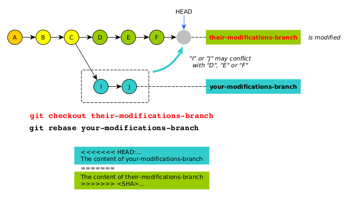

# Configuring SSH for two GitHub users

Let's say that you have two GitHub accounts configured using the following parameters:

Your first GitHub account:

* Your login: `your-login-1`
* Your email address: `your-login-1@domain.com`
* Your private SSH key stored in the file `~/.ssh/ssh_github-1`.

Your second GitHub account:

* Your login: `your-login-2`
* Your email address: `your-login-2@domain.com`
* Your private SSH key stored in the file `~/.ssh/ssh_github-2`.

When accessing GitHub, you want the SSH client (launched behind the scenes by the GIT client) to perform the following actions:

* use the private key that is associated to the public key you downloaded to your GitHub account.
* use your GitHub login.

## Configuration

One way to do that is to associate a couple `(private key, login)` to an alias. This behaviour is configured in the SSH configuration file `~/.ssh`. For example:

    host personal.github.com
         HostName github.com
         User your-login-1
         PreferredAuthentications publickey
         IdentityFile ~/.ssh/ssh_github-1
         IdentitiesOnly yes

    host profesional.github.com
         HostName github.com
         User your-login-2
         PreferredAuthentications publickey
         IdentityFile ~/.ssh/ssh_github-2
         IdentitiesOnly yes

This way, when the SSH client opens a connexion to the host `github.com`, using the alias `personal.github.com`, it uses the login (`your-login-1`) and the SSH key (`~/.ssh/ssh_github-1`).

## Testing

Run the command below:

    $ ssh -T git@personal.github.com
    Hi your-login-1! You've successfully authenticated, but GitHub does not provide shell access.

    $ ssh -T git@profesional.github.com
    Hi your-login-2! You've successfully authenticated, but GitHub does not provide shell access.

> If you need to check the repository configuration: `git config -l`

## SSH troubleshouting

Here are some useful commands.

Check the fingerprint of an SSH key:

    $ sh-keygen -l -E sha256 -f $SSH_KEY_FILE

> You can make sure that the private SSH you have matches to the public key you uploaded on GitHub.

Load the private keys into the SSH user agent:

    $ ssh-add
    @@@@@@@@@@@@@@@@@@@@@@@@@@@@@@@@@@@@@@@@@@@@@@@@@@@@@@@@@@@
    @         WARNING: UNPROTECTED PRIVATE KEY FILE!          @
    @@@@@@@@@@@@@@@@@@@@@@@@@@@@@@@@@@@@@@@@@@@@@@@@@@@@@@@@@@@
    Permissions 0644 for '/home/denis/.ssh/id_rsa' are too open.
    It is required that your private key files are NOT accessible by others.
    This private key will be ignored.

> If you get this error message, then you know that the permissions for the directory `.ssh` are not valid. You must have `-rw-------` for all files within the `.ssh` directory. And, for the `.ssh` directory, the permissions must be `drwx------`.

Print the list of loaded private keys:

    $ ssh-add -l

# Configuring a repository

    $ git remote add origin git@personal.github.com:your-login-1/your-repository.git
    $ git config user.email "your-login-1@domain.com"

or:

    $ git remote add origin git@profesional.github.com:your-login-2/your-repository.git
    $ git config user.email "your-login-2@domain.com"

To see the configuration:

    $ git config --list
    $ git config --get-all user.email
    $ git config --get-all remote.origin.url

Il you need to unset/remove a configuration paramter:

    $ git config --unset user.email your-login-1@domain.com
    $ git remote rm origin

If you need to change the origin URL:

    $ git remote set-url origin git@personal.github.com:your-login-1/your-repository.git

> This command may be useful depending on your GitHub account settings.

# Troubleshooting

## Activate the debug output

If you have a problem while performing a GIT command, you can try this commands:

    GIT_TRACE=2 git push --verbose -u origin master

Or, even better:

    GIT_CURL_VERBOSE=1 GIT_TRACE=1 git push -u origin master

## Did you get this error ? "error: failed to push some refs to..."

You probably need to commit something.

# Useful commands

## Use of --procelain

### Add all modified files to the staging area

    git status --porcelain | egrep '^ M ' | sed --expression='s/^ M //' | xargs -n1 git add

> Same as `git add --all`

### Commit all staged files

    git status --porcelain | egrep '^M  ' | sed --expression='s/^M  //' |  xargs -n1 git commit -m "Your message"

> Will generate as many commits as files (this is not equivalent to a single `git commit`).

### Commit all the modification at once

    $ git status --porcelain | perl -e '@lines = (); while (<STDIN>) { chomp; $_ =~ s/^ *(M|A|D|R|C|U) //; push(@lines, $_); } print join(" ", @lines);' | xargs git add

    $ git status --porcelain | perl -e '@lines = (); while (<STDIN>) { chomp; unless($_ =~ m/^ *M /) { next; }; $_ =~ s/^ *M //; push(@lines, $_); } print join(" ", @lines);' | xargs git add

    $ git status --porcelain | perl -e '@lines = (); while (<STDIN>) { chomp; unless($_ =~ m/^ *D /) { next; }; $_ =~ s/^ *D //; push(@lines, $_); } print join(" ", @lines);' > delete.sh

## Make an initial empty commit

    git commit --allow-empty -m "initial commit"

> Please note:
>
> Git represents branches as pointers to the latest commit in that branch. If you haven't created a commit yet, there's nothing for that branch to point to. So you can't really create branches until you have at least one commit [source](https://stackoverflow.com/questions/5678699/creating-branches-on-an-empty-project-in-git/5678812).

## Inject the modifications into the repository

    git push -u origin master

## Change the case

    git mv foldername tempname && git mv tempname folderName
    git mv Entrypoints tempname && git mv tempname EntryPoints

## Print the LOG (print commits)

### For the current branch

    git log --pretty="%h %an %ae"

Add color and filter on commits author:

    git log --stat --pretty=format:"%C(#ff69b4)#####> %h - %an, %ar :%C(reset)%n%n%C(#FFFF00)%s%c(Reset)%n%n%b" --author="Denis BEURIVE"

> Please note that you may need to use `git fetch` first.

Add the file(s) associated with the commits (add option `--name-only`):

    $ git log --pretty=format:"%C(green)%h%C(Reset) %s" --name-only

Add the names of the commits authors (add "`%an`"):

    $ git log --pretty=format:"%C(green)%h%C(Reset) %C(red)%an%C(Reset) %s%n%aD" --name-only

This command may be useful to compare commits histories between branches:

    git log  --pretty=format:"%C(green)%h%C(Reset) %ai <%an> %s" | head -n 20 | less --chop-long-lines

> You have:
> * the commit (sha) tag.
> * the date.
> * the author.
> * the message.
> * terminal word wrap is disabled.

### For another branch

Just specify the name of the branch:

    git log --pretty=format:"%ct %h %s" feature

### For a set of branches

Just specify the names of the branches:

    $ git log --pretty=format:"%ct %h %s" feature master
    1622741213 2778ac8 3. edit from master
    1622741170 a38453b 2. edit from feature
    1622741110 a53d88c 1. edit from master
    1622741055 bfb5b09 initial commit

> The cool thing is that the commits are chronologically sorted.

## Print the changed applied to a specific commit

    $ git diff <commit SHA>

> Please note that you may need to use `git fetch` first.

## Print the remote configuration

    git remote -v

If you need to remove a remote:

    git remote rm <name of the remote> # For example git remote rm origin

## Tags

If you need to tag:

    git tag -a 1.0.0 -m "First version"
    git push origin --tags

If you need to delete the tag:

    git tag -d 1.0.0
    git push origin :refs/tags/1.0.0

Check the tags on the remote:

    git ls-remote --tags

## Remove a file from the (remote) repository

The command below removes files on the (remote) repository only.
It does not remove the file from the local filesystem.

    git rm --cached /path/to/the/file 
    git commit -m "remove /path/to/the/file"
    git push -u origin master

## Create a repository on the GIT server (which may be localhost)

    $ cd /opt/git
    $ mkdir projet.git
    $ cd projet.git
    $ git --bare init

## Create a new branch

    $ git checkout -b refactoring
    Switched to a new branch 'refactoring'

    $ git branch
      master
    * refactoring

## Push a branch

### Secure

    $ git push origin refactoring

### Unsecure

The following replaces the remote branch by the local one, **no matter the context**:

    $ git push -f origin refactoring    

## Merge a branch

    $ git branch
      master
    * refactoring
    
    $ git checkout master
    Switched to branch 'master'
    
    $ git merge refactoring

    $ git push origin master

## Delete a local branch

### Secure

First, make sure that the branch has been merged:

    git branch --merged

Then, you can delete it:

    git branch -d refactoring

### Unsecure

The following command deletes the branch, **no matter its state**:

    git branch -D refactoring

## Delete a remote branch

First, make sure that the remote branch has been merged:

    git branch -r merged

Then, you can delete it:

    git push origin --delete refactoring

## Save authentication parameters

    git config credential.helper store

or:

    git config --global credential.helper store

For a session only:

    git config --global credential.helper cache

## Force the update of the local branch from the remote one

The following command will force the update of the local branch `master`:

    git checkout master
    git fetch
    git reset --hard origin/master

## Check a .gitignore file

Assuming that you have the following `.gitignore` file:

    .gradle/
    build/
    libs/
    .idea/
    lib/

Then, you can make sure that a particular entry (file or directory) is ignored:

    $ git check-ignore -v */lib
    .gitignore:5:lib/   app-cbc-des/lib
    .gitignore:5:lib/   app-cfb-des/lib

## Global .gitignore

You can create a `.gitignore` file that will apply for all your projects:

    git config --global core.excludesFile ~/.gitignore

## Import the branch metadata only (do not merge)

For a single branch:

    git checkout <your branch>
    git fetch

For all branches:

    git fetch --all

or, which is equivalent:

    git remote update

**Note**:

Once the local repository has been updated/fetched, we can compare the local branch with the remote one:

    git diff <your branch> origin/<your branch>  # or: git diff main @{upstream}

## Print details about a specific commit

    git show <commit SHA>

Example:

    $ git log --pretty=format:"%C(green)%h%C(Reset) %s"
    8699120 Edit file2 for the first time
    faf7388 Create file2. This message has been modified.
    50659dc Create file1. This message has been modified.
    9fb518b first commit

    $ git show faf7388
    commit faf7388eec0e94f601a2af506dfea81ca60c31e4
    Author: Denis BEURIVE <dbeurive@protonmail.com>
    Date:   Thu May 6 11:46:00 2021 +0200

        Create file2. This message has been modified.

    diff --git a/file2 b/file2
    new file mode 100644
    index 0000000..e69de29

If you are just interested by the files associated with a commit:

    git show --pretty="" --name-only <commit SHA>
 
If you need to show the last commit:

    git show HEAD

## Checkout a specific commit

    git checkout <commit SHA>

For example:

    git checkout b928950669f5da9414000de50c3a3ba7f7be7597

## Set specific editor for interactive oprations

for version 3 of Sublime Text:

    git config --global core.editor "/home/denis/Documents/softwares/sublime_text_3/sublime_text -n -w"

Or, for version 4 of Sublime Text:

    git config --global core.editor "/usr/bin/subl -n -w"

> Source: [Git Tips #2 - Change editor for interactive Git rebase](https://www.kevinkuszyk.com/2016/03/08/git-tips-2-change-editor-for-interactive-git-rebase/)

## Test if a local repository is up to data

    git fetch --dry-run

> Git "fetch" Downloads commits, objects and refs from another repository. It fetches branches and tags from one or more repositories. 

## Change commits messages

In order to change commits, you use the command `rebase`.

    $ git log  --pretty=format:"%C(green)%h%C(Reset) %s"
    b34a05c Edit file2 for the first time
    174f7f2 Create file2
    c4fb274 Create file1
    9fb518b first commit

Let's say that you want to change the messages for the commits `174f7f2` and `c4fb274`. Then you need to consider the 3 last commits.

> Please note that a all commits you want to edit must have a parent commit. This means that, in our example, the commit `9fb518b` cannot be edited.

    COMMITS_COUNT=3
    git rebase -i HEAD~${COMMITS_COUNT}

> Please note that the command below may be useful to find out the value of COMMITS_COUNT: `max=$(echo "$(git log --pretty=format:"#> %h")" | wc -l) && echo "max=${max}"`

Then GIT will open the editor you configured and ask you to modify the printed text. For example:

    pick c4fb274 Create file1
    pick 174f7f2 Create file2
    pick b34a05c Edit file2 for the first time

    # Rebasage de 9fb518b..b34a05c sur 9fb518b (3 commandes)
    #
    # Commandes :
    #  p, pick <commit> = utiliser le commit
    #  r, reword <commit> = utiliser le commit, mais reformuler son message
    # ...

Then for `174f7f2` and `c4fb274`, change "`pick`" to "`reword`". That is:

    reword c4fb274 Create file1
    reword 174f7f2 Create file2
    pick b34a05c Edit file2 for the first time

Close the editor and follow the instructions... At the end, you get:

    $ git rebase -i HEAD~3
    [HEAD détachée 50659dc] Create file1. This message has been modified.
     Date: Thu May 6 11:03:45 2021 +0200
     1 file changed, 1 insertion(+)
     create mode 100644 file1
    [HEAD détachée faf7388] Create file2. This message has been modified.
     Date: Thu May 6 11:46:00 2021 +0200
     1 file changed, 0 insertions(+), 0 deletions(-)
     create mode 100644 file2
    Rebasage et mise à jour de refs/heads/main avec succès.

And:

    $ git log --pretty=format:"#> %h %s"
    #> 8699120 Edit file2 for the first time
    #> faf7388 Create file2. This message has been modified.
    #> 50659dc Create file1. This message has been modified.
    #> 9fb518b first commit

> Please note that the commits SHA have been modified.

## Override branches

### Override a REMOTE branch by LOCAL branch

Let's say that you want to _completely override_ the remote branch "`issue135`" by the local branch "`issue135-clean`".

    $ git branch
    * master
      issue135-clean

Checkout the branch "`issue135-clean`":

    $ git checkout issue135-clean

Rename the current branch (that is "`issue135-clean`") into "`issue135`":

    $ git branch -m issue135
    $ git branch
    * issue135
      master

Then push (from now on) the branch "`issue135`":

    $ git push -f origin issue135

> Please note the use of the option `-f` (force).

### Override a LOCAL branch by REMOTE branch

Let's say that you want to _completely override_ the local branch "`issue135`" by the remote branch "`issue135`".

    $ git branch
    * issue135
      master

    $ git fetch --all

    $ git reset --hard origin/issue135

> **WARINING**: all modifications made on the local branch will be lost!

# "origin" vs "upstream"

From this [excellent explenation](https://stackoverflow.com/questions/9257533/what-is-the-difference-between-origin-and-upstream-on-github):

The difference between `upstream` and `origin` should be understood in the context of GitHub forks
(where you fork a GitHub repository on GitHub before cloning that fork locally).

* `upstream` generally refers to the original repository that you have forked.
* `origin` is your fork: your own repository on GitHub, clone of the original repository of GitHub.

> Please note that these names are conventions, simple alias. You can use other names as long as you know what they mean.

Print your configuration:

    $ git config --get-regexp remote.origin.*
    remote.origin.url https://...
    remote.origin.fetch +refs/heads/*:refs/remotes/origin/*

    $ git config --get-regexp remote.upstream.*
    remote.upstream.url https://...
    remote.upstream.fetch +refs/heads/*:refs/remotes/upstream/*

Delete a configuration:

    git config --unset remote.origin.url
    git config --unset remote.origin.fetch
    git config --get-regexp remote.origin.*

    git config --unset remote.upstream.url
    git config --unset remote.upstream.fetch
    git config --get-regexp remote.upstream.*

Set a configuration:

    ORIGIN_URL=https://your.origin.repository.url
    git remote add origin ${ORIGIN_URL}
    git config --get-regexp remote.origin.*

    UPSTREAM_URL=https://your.upstream.repository.url
    git remote add upstream ${UPSTREAM_URL}
    git config --get-regexp remote.upstream.*

**Quick note: synchronising local/remote repositories**

If you want to update you local branch from "upstream" (the _official project repository_ that you forked):

    git checkout master
    git fetch upstream
    git pull upstream master

> You can also override your local branch: `git reset --hard upstream/master` (see [here](https://stackoverflow.com/questions/15432052/what-is-the-meaning-of-git-reset-hard-origin-master/15432250))

Now, you can push the downloaded modifications to your distant forked repository:

    git push origin master

Now, your _forked project repository_ is synchronized with the _official project repository_.

# Reading git conflict. What is "yours" and "theirs" ?

Official explanation: [HOW CONFLICTS ARE PRESENTED](https://git-scm.com/docs/git-merge#_how_conflicts_are_presented)

In a nutshell:

    <<<<<<< yours:sample.txt
    Conflict resolution is hard;
    let's go shopping.
    =======
    Git makes conflict resolution easy.
    >>>>>>> theirs:sample.txt

## Rebase

We do:

    git checkout their-modifications-branch
    git rebase your-modifications-branch

**Vocabulary**: we say that `their-modifications-branch` is _rebased onto_ `your-modifications-branch` ([source](https://git-scm.com/book/en/v2/Git-Branching-Rebasing)).

> * we are on `their-modifications-branch`.
> * We modify `their-modifications-branch`.
> * `HEAD` _always_ refers to a commit _coming from_ `your-modifications-branch`.
>
> The names of the branches in this example are not necessarily appropriate, relatively to the context.
> That is, depending on _who_ is doing the _rebase_ (relatively to the modifications author).
> That's why it can be confusing.

Thus:

    <<<<<<< HEAD:...
    Your modifications.
    =======
    Their modifications.
    >>>>>>> 3959352...

# Quick "do / undo"

| Do                                                       | Undo                                          | Note                                             | Examples                         |
|----------------------------------------------------------|-----------------------------------------------|--------------------------------------------------|----------------------------------|
| `git add <file>`                                         | `git reset <file>`                            |                                                  |                                  |
| `git commit`                                             | `git commit --amend`                          | Change message for the last commit only          |                                  |
| `git commit`                                             | `git reset --soft HEAD~1`                     | Undo last commit, but preserve changes           |                                  |
| `git commit`                                             | `git reset --hard HEAD~1`                     | Undo last commit, but **discard changes**!       |                                  |
| multiple `git commit`                                    | `git reset --soft <commit sha>`               | Undo multiple commits, but preserve changes      | [ex](examples/git-reset-soft.md) |
| multiple `git commit`                                    | `git reset --hard <commit sha>`               | Undo multiple commits, but **discard changes**!  | [ex](examples/git-reset-hard.md) |
| `git reset --soft <commit sha>`                          | `git reset 'HEAD@{1}'`                        |                                                  | [ex](examples/git-reset-head.md) |
| `git stash`                                              | `git stash pop`                               |                                                  |                                  |
| `git merge`                                              | `git merge --abort`                           | If you cannot merge...                           |                                  |
| You modify a file... but you want to discard all changes | `git restore -s origin/<branch> -- <file>`    | Get the file from a remote branch                |                                  |

# Rebase

## Work with branches

Will remove commits included in the interval `]<new parent>, <last commit to remove>]`.

Ideal arrangement (no conflict):

> **Vocabulary**: we say that `master` is _rebased onto_ `feature` ([source](https://git-scm.com/book/en/v2/Git-Branching-Rebasing)).

However, be aware that conflicts may disturb this ideal arrangement.

## Work with commits

    git rebase --onto <new parent> <last commit to remove> <new head>

> or `git rebase --onto <new parent> <old parent> <new head>`.

If the last parameter is not specified, then its value is `HEAD`.

    git rebase --onto <new parent> <last commit to remove>

> or `git rebase --onto <new parent> <old parent>`.

The long story... [see here](rebase.md).

## Tips and tricks during rebase

Show the SHA of the commit that is being the source of a conflict:

    $ git rebase --show-current-patch | head -n 1
    commit 3959352cdef7d3b458c4278d859a79203f101e93

# GIT general tips

## Add branch name to Bash prompt

Add this in your file `.bashrc`:

    parse_git_branch() {
         git branch 2> /dev/null | sed -e '/^[^*]/d' -e 's/* \(.*\)/ (\1)/'
    }

    PS1='${debian_chroot:+($debian_chroot)}\[\033[01;32m\]\u@\h\[\033[00m\]:\[\033[01;34m\]\w\[\033[00m\]\[\033[01;33m\]`parse_git_branch`\[\033[0m\]\$ '

> The important point here is ``\[\033[01;33m\]`parse_git_branch`\[\033[0m\]``.
>
> [Good link](https://superuser.com/questions/382456/why-does-this-bash-prompt-sometimes-keep-part-of-previous-commands-when-scrollin) in case you have a problem with the colors.
>
> Links for colors:
> * [Bash Shell PS1: 10 Examples to Make Your Linux Prompt like Angelina Jolie](https://www.thegeekstuff.com/2008/09/bash-shell-ps1-10-examples-to-make-your-linux-prompt-like-angelina-jolie/)
> * [Bash tips: Colors and formatting (ANSI/VT100 Control sequences)](https://misc.flogisoft.com/bash/tip_colors_and_formatting)

## Read a "rebase" conflict message

    $ git checkout feature
    $ git rebase master
    Fusion automatique de path/to/file
    CONFLIT (contenu) : Conflit de fusion dans path/to/file
    error: impossible d'appliquer 3959352... the commit message...
    Resolve all conflicts manually, mark them as resolved with
    "git add/rm <conflicted_files>", then run "git rebase --continue".
    You can instead skip this commit: run "git rebase --skip".
    To abort and get back to the state before "git rebase", run "git rebase --abort".
    impossible d'appliquer 3959352... the commit message...

You are applying the commit `3959352` (from master) to the `HEAD` of `feature`:

    master/3959352 ---> HEAD/feature

## Find the commits that are in a branch, but not in another one

Find the commit that are in `BRANCH1` but not in `BRANCH2`

    BRANCH1="master"
    BRANCH2="feature"

    diff <(git log --pretty=format:"%h %ai <%an> %s" ${BRANCH1}) <(git log --pretty=format:"%h %ai <%an> %s" ${BRANCH2}) | grep '^<'    | sed 's|^< ||'

## Show what has been done to files on a specific commit

    $ git show 3959352 --summary
    commit 3959352cdef7d3b458c4278d859a79203f101e93
    Author: Denis Beurivé <dbeurive@protonmail.com>
    Date:   Fri May 28 17:57:27 2021 +0200

        The commit message.
        
        Ref: #123

     create mode 100644 __init__.py
     create mode 100644 file1.py
     create mode 100644 file2.py
     create mode 100644 file3.py
     rename postproc/{file4.py => file5.py} (57%)
     create mode 100644 file6.py

> The line `rename postproc/{file4.py => file5.py} (57%)` indicates that a file has been **split**. **You should be VERY careful**: you cannot rely on GIT to show you what changed between the two commits! You must look at the code very carefully.

