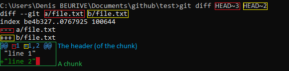

Build a test repository:

```
C:\github\test>echo "line 1" >> file.txt
C:\github\test>git add file.txt
C:\github\test>git commit -m "first commit: add the first line"

C:\github\test>echo "line 2" >> file.txt
C:\github\test>git add file.txt
C:\github\test>git commit -m "second commit: add the second line"

C:\github\test>echo "line 3" >> file.txt
C:\github\test>git add file.txt
C:\github\test>git commit -m "third commit: add the third line"

C:\github\test>echo "line 4" >> file.txt
C:\github\test>git add file.txt
C:\github\test>git commit -m "fourth commit: add the fourth line"

C:\github\test>git log --pretty=format:"%h %s"
a138142 fourth commit: add the fourth line
0a011a2 third commit: add the third line
f446de6 second commit: add the second line
9a58eab first commit: add the first line
```

Note:

* `a138142`: `HEAD` - the fourth (and last) commit
* `0a011a2`: `HEAD~1` - the third commit
* `f446de6`: `HEAD~2` - the second commit
* `9a58eab`: `HEAD~3` - the first commit

What is the difference between the first and the second commit ?

```
C:\github\test>git diff HEAD~3 HEAD~2
diff --git a/file.txt b/file.txt
index be4b327..0767925 100644
--- a/file.txt
+++ b/file.txt
@@ -1 +1,2 @@
 "line 1"
+"line 2"
```

Explanation:



* `a/file.txt`: the version of the file at commit `HEAD~3` (the first commit).
* `b/file.txt`: the version of the file at commit `HEAD~2` (the second commit).
* `--- a/file.txt`: in a chunk, the lines related to the file at commit `HEAD~3` will be marked by the character "`-`".
* `+++ b/file.txt`: in a chunk, the lines related to the file at commit `HEAD~2` will be marked by the character "`+`".
* `@@ -1 +1,2 @@`: this is the header (of the chunk) => `@@ -<first line>,<number of lines printed> +<first line>,<number of lines printed>`
   * `-1` starts with `-`, so this data is related to the the file at commit `HEAD~3`.
   `-1` is equivalent to `-1,1`. It means that one line of the file (at commit `HEAD~3`), starting at the first line, is printed. That is: only the first line of the file is printed.
   * `+1,2`: starts with `+`, so this data is related to the the file at commit `HEAD~2`. It means that 2 lines of the file (at commit `HEAD~2`), starting at the first line, is printed. That is: lines 1 and 2 are printed.

> **WARNING**: the signs "`-`" and "`+`" must not be interpreted as "removed" and "added". Within a chunk, these signs just identify the file data are related to.
> * "`-<data>`": the data is related to the file associated with the commit ID given as the first parameter to the command.
> * "`+<data>`": the data is related to the file associated with the commit ID given as the second parameter to the command.

```
@@ -1 +1,2 @@
 "line 1"
+"line 2"
```

* The first line can be found in both versions of the file.
* The second line is found only the version of the file associated with the commit which id is `HEAD~2`.


