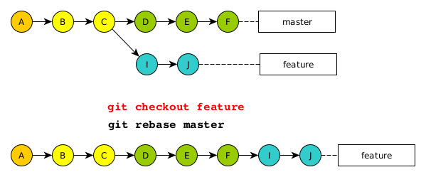
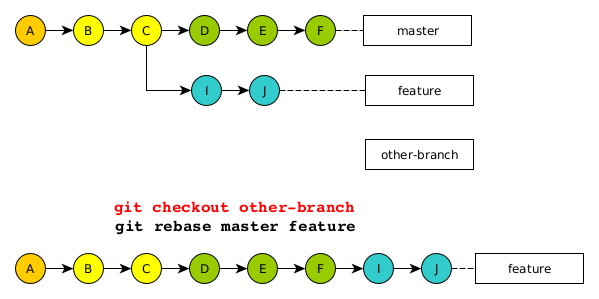
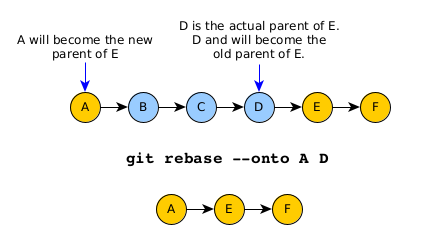
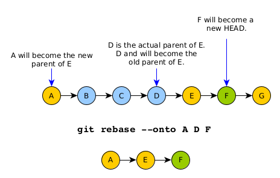

# Git rebase

	rebase <=> re-base 
	       <=> change the base
	       <=> set a new "parent" (inherit from another branch)

### First form: git rebase \<new parent\>

We have to branches:
* `master`
* `rebase`

With the following commit histories for branches `master` and `rebase`:

	$ git log --pretty=format:"%C(green)%h%C(Reset) %s"

| master                                    | rebase                                   |
|-------------------------------------------|------------------------------------------|
| _3995d9a Document print_result()_         | _af1f3df Document print_version()_         |
| _7b7855a Add the function print_result()_ | _628589b Add the function print_version()_ |
| --                                        | --                                       |
| 8bc7df3 Document calc()                   | 8bc7df3 Document calc()                  |
| 6c99621 Document init_matrix()            | 6c99621 Document init_matrix()           |
| 9e31a77 First import                      | 9e31a77 First import                     |
| 87d762b initial commit                    | 87d762b initial commit                   |

We want to **re-base** the branch `rebase`.

What we plan to do is:

* change the commit history of the branch `rebase`.
* add the history [`3995d9a`, `7b7855a`] of `master` to the history of `rebase`.

In orther words, we want to have the following history (on `rebase`):

	af1f3df Document print_version()
	628589b Add the function print_version()
	3995d9a Document print_result()           # <- from master
	7b7855a Add the function print_result()   # <- from master
	8bc7df3 Document calc()
	6c99621 Document init_matrix()
	9e31a77 First import
	87d762b initial commit

Proceed to `git checkout <new parent>`.

> The important point here is that we move on branch `rebase`.

	$ git checkout rebase
	Basculement sur la nouvelle branche 'rebase'

	$ git rebase master
	...
	impossible d'appliquer 628589b... Add the function print_version()

We resolve the conflict. Then we add the fixed file to the stage and we continue the rebase operation.

	$ git add bin/calculator.py 

	$ git rebase --continue
	[HEAD détachée e142988] Add the function print_version()
	 1 file changed, 3 insertions(+)
	Rebasage et mise à jour de refs/heads/rebase avec succès.

The histories are now:

| master                                    | rebase                                     |
|-------------------------------------------|--------------------------------------------|
|                                           | _a711c3e Document print_version()_         |
|                                           | _49394ec Add the function print_version()_ |
| _3995d9a Document print_result()_         | _3995d9a Document print_result()_          |
| _7b7855a Add the function print_result()_ | _7b7855a Add the function print_result()_  |
| --                                        | --                                         |
| 8bc7df3 Document calc()                   | 8bc7df3 Document calc()                    |
| 6c99621 Document init_matrix()            | 6c99621 Document init_matrix()             |
| 9e31a77 First import                      | 9e31a77 First import                       |
| 87d762b initial commit                    | 87d762b initial commit    

### Second form: git rebase \<new parent\> \<branch\>

> This form is equivalent to the first one (`git rebase <new parent>`) if you are on branch `branch`.

We have 3 branches:
* `master`
* `rebase`
* `other-branch`

> Please note that the branch `other-branch` is not important. It only will be used to run
> the _rebase_ command from.

With the following commit histories for branches `master` and `rebase`:

	$ git log  --pretty=format:"%C(green)%h%C(Reset) %s"

| master                                    | rebase                                     |
|-------------------------------------------|--------------------------------------------|
| _3995d9a Document print_result()_         | _af1f3df Document print_version()_         |
| _7b7855a Add the function print_result()_ | _628589b Add the function print_version()_ |
| --                                        | --                                         |
| 8bc7df3 Document calc()                   | 8bc7df3 Document calc()                    |
| 6c99621 Document init_matrix()            | 6c99621 Document init_matrix()             |
| 9e31a77 First import                      | 9e31a77 First import                       |
| 87d762b initial commit                    | 87d762b initial commit                     |

Proceed `git rebase <new parent> <branch>`:

> The important point here is that we are **NOT** on the branch `rebase`.

	$ git checkout other-branch
	Basculement sur la branche 'other-branch'

	$ git rebase master rebase
	Rebasage et mise à jour de refs/heads/rebase avec succès.

The histores are now:

| master                                    | rebase                                     |
|-------------------------------------------|--------------------------------------------|
|                                           | _a711c3e Document print_version()_         |
|                                           | _49394ec Add the function print_version()_ |
| _3995d9a Document print_result()_         | _3995d9a Document print_result()_          |
| _7b7855a Add the function print_result()_ | _7b7855a Add the function print_result()_  |
| --                                        | --                                         |
| 8bc7df3 Document calc()                   | 8bc7df3 Document calc()                    |
| 6c99621 Document init_matrix()            | 6c99621 Document init_matrix()             |
| 9e31a77 First import                      | 9e31a77 First import                       |
| 87d762b initial commit                    | 87d762b initial commit                     |

## Git rebase --onto

### First form: Git rebase --onto \<new parent\> \<old parent\>

Commit history:

	$ git log  --pretty=format:"%C(green)%h%C(Reset) %s"
	c3970ee Add a version tag
	1cbc8c3 Document the file
	20d2b8c Document print_version()
	f1b186e Add the function print_version()
	3995d9a Document print_result()
	7b7855a Add the function print_result()
	8bc7df3 Document calc()
	6c99621 Document init_matrix()
	9e31a77 First import
	87d762b initial commit

We want to remove the commits from `7b7855a` (included) to `20d2b8c` (included).

> Thus:
> * we want to connect `1cbc8c3` directly to `8bc7df3`.
> * in other words: we want `8bc7df3` to the new _parent commit_ for `1cbc8c3`.

We can use this command:

	git rebase --onto 8bc7df3 20d2b8c

This should be read:

	git rebase --onto <new parent> <last commit to remove>

> or `git rebase --onto <new parent> <old parent>`.

Will remove commits included in the interval `]<new parent>, <last commit to remove>]`.

That is: it will remove all commits within the interval from `8bc7df3`
(exclusive) to `20d2b8c` (inclusive). That is: `]8bc7df3, 20d2b8c]`.

	$ git log  --pretty=format:"%C(green)%h%C(Reset) %s"
	e32e501 Add a version tag
	8551788 Document the file
	8bc7df3 Document calc()
	6c99621 Document init_matrix()
	9e31a77 First import
	87d762b initial commit

That is the expected result.

### Second form: Git rebase --onto \<new parent\> \<old parent\> \<new head\>

Commit history:

	$ git log  --pretty=format:"%C(green)%h%C(Reset) %s"
	724a030 Add the sub-version tag
	0ed68e9 Fix the version tag
	f32f3fe Add version tag
	16d0c1b Add file description
	20d2b8c Document print_version()
	f1b186e Add the function print_version()
	3995d9a Document print_result()
	7b7855a Add the function print_result()
	8bc7df3 Document calc()
	6c99621 Document init_matrix()
	9e31a77 First import
	87d762b initial commit

	$ git rebase --onto 20d2b8c f32f3fe 0ed68e9

This should be read:

	git rebase --onto <new parent> <last commit to remove> <new head>

> or `git rebase --onto <new parent> <old parent> <new head>`.

	$ git branch
	* (HEAD détachée depuis 0ed68e9)
	  feature
	  master
	  rebase

	$ git log  --pretty=format:"%C(green)%h%C(Reset) %s"
	cd48c63 Fix the version tag
	20d2b8c Document print_version()
	f1b186e Add the function print_version()
	3995d9a Document print_result()
	7b7855a Add the function print_result()
	8bc7df3 Document calc()
	6c99621 Document init_matrix()
	9e31a77 First import
	87d762b initial commit

Create a new branch:

	$ git branch new-branch

	$ git checkout new-branch

	$ git log  --pretty=format:"%C(green)%h%C(Reset) %s"
	cd48c63 Fix the version tag
	20d2b8c Document print_version()
	f1b186e Add the function print_version()
	3995d9a Document print_result()
	7b7855a Add the function print_result()
	8bc7df3 Document calc()
	6c99621 Document init_matrix()
	9e31a77 First import
	87d762b initial commit

