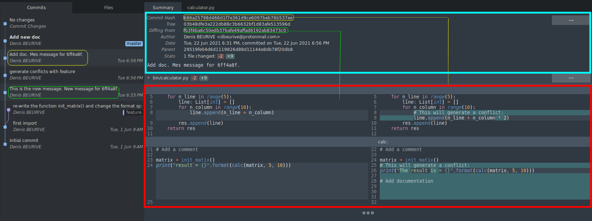

# GIT general tips

## Using expect for cloning

File "`cloner`" (`chmod +x cloner`).

```
#!/usr/bin/expect
#
# git credential-cache exit && ./cloner https://...

set LOGIN {your login}
set PASSWORD {your password}
set REPOSITORY [lindex $argv 0]

spawn git -c http.sslVerify=false clone $REPOSITORY
expect -exact {Username for}
send -- "$LOGIN\r"
expect -exact {Password for}
send -- "$PASSWORD\r"
set timeout -1  ; # no timeout
expect eof
```

**Usage**: `./cloner <repository URI>`

## Add repository configuration to Bash prompt + usefull commands

Add this in your file `.bashrc`:

```shell

git_help() {
    # Print the list of custom commands.
    declare -F | awk {'print $3'} | egrep '^git_'
}

git_conf_check() {
  # Check the confguration of the local repository.
  local origin
  local upstream
  local origin_value
  local upstream_value

  origin=$(git config --get remote.origin.url)
  upstream=$(git config --get remote.upstream.url)

  if [ -z "${origin}" ]; then
      printf "WARNING: \"remote.origin.url\" is not configured!\n"
      return
  fi

  if [ -z "${upstream}" ]; then
      return
  fi

  origin_value=$(echo "${origin}" | sed --expression='s/^.*\/\([^\/]*\)$/\1/')
  upstream_value=$(echo "${upstream}" | sed --expression='s/^.*\/\([^\/]*\)$/\1/')

  if [ "${origin_value}" != "${upstream_value}" ]; then
      printf "ERROR: \"remote.origin.url\" (%s) and \"remote.upstream.url\" (%s) mismatch!\n" "${origin_value}" "${upstream_value}"
      return
  fi

  return
}

git_conf_print() {
  # Print the local repository cionfiguration.
  local origin
  local upstream
  local name
  local email
  local branch
  local status
  local default_branch

  name=$(git config user.name)
  email=$(git config user.email)
  branch=$(git branch | sed -e '/^[^*]/d' -e 's/* \(.*\)/\1/')
  origin=$(git config --get remote.origin.url)
  upstream=$(git config --get remote.upstream.url)
  status=$(git_conf_check)
  default_branch=$(git remote show "${origin}" | sed -n '/HEAD/s/.*: //p')

  printf "Git configuration:\n\n"
  printf "USER:     \"%s\"\n" "${name}"
  printf "EMAIL:    \"%s\"\n" "${email}"
  printf "BRANCH:   \"%s\" (default: \"%s\")\n" "${branch}" "${default_branch}"
  printf "ORIGIN:   \"%s\"\n" "${origin}"
  printf "UPSTREAM: \"%s\"\n" "${upstream}"

  if [ -z "${status}" ]; then
     printf "\n%s\n" "${status}"
  fi
}

git_get_id() {
  local status=$(git rev-parse --git-dir > /dev/null 2>&1; echo $?)
  if [ "${status}" -eq "0" ]; then
    local name
    local email
    local branch
    local origin
    local status

    name=$(git config user.name)
    email=$(git config user.email)
    branch=$(git branch | sed -e '/^[^*]/d' -e 's/* \(.*\)/\1/')
    origin=$(git config remote.origin.url)

    status=$(git_conf_check)
    if [ -z "${status}" ]; then
       printf "\nname:   [%s]\nemail:  [%s]\norigin: [%s]\nbranch: [%s]" "${name}" "${email}" "${origin}" "${branch}"
    else 
       printf "\nname:   [%s]\nemail:  [%s]\norigin: [%s]\nbranch: [%s]\n\n%s" "${name}" "${email}" "${origin}" "${branch}" "${status}"
    fi
  else
    printf ""
  fi;
}

if [ "$color_prompt" = yes ]; then
    PS1='${debian_chroot:+($debian_chroot)}\[\033[01;32m\]\u@\h\[\033[00m\]:\[\033[01;34m\]\w\[\033[00m\]\[\033[01;93m\]`git_get_id`\[\033[0m\]\$ ' 
else
    PS1='${debian_chroot:+($debian_chroot)}\u@\h:\w\$ '
fi
```

Result:


> The important point here is ``\[\033[01;33m\]`get_git_id`\[\033[0m\]``.
>
> [Good link](https://superuser.com/questions/382456/why-does-this-bash-prompt-sometimes-keep-part-of-previous-commands-when-scrollin) in case you have a problem with the colors.
>
> Links for colors:
> * [Bash Shell PS1: 10 Examples to Make Your Linux Prompt like Angelina Jolie](https://www.thegeekstuff.com/2008/09/bash-shell-ps1-10-examples-to-make-your-linux-prompt-like-angelina-jolie/)
> * [Bash tips: Colors and formatting (ANSI/VT100 Control sequences)](https://misc.flogisoft.com/bash/tip_colors_and_formatting)

Note that you can get the local data only:

```shell
name=$(git config --local --get-all user.name)
email=$(git config --local --get-all user.email)
```

## Quickly set configuration for several accounts

Put this function into your `~/.bashrc`.

```shell
git_set_account() {
   if [ -d .git ]; then
      local upstream_cmd="git remote add upstream \"git@domain.com:group1/repos.git\""

      case "${1}" in
         account1)
              printf "Set configuration for GIT account [%s]\n" "${1}"
              git config user.email "account1@domain.com"
              git config user.name "Name"
              printf "Done\n\n"
              ;;
         account2)
              printf "Set configuration for GIT account [%s]\n" "${1}"
              git config user.email "account2@domain.com"
              git config user.name "Name"
              printf "Done\n\n"
              ;;
         *)
              printf "Unexpected account [%s]\n" $1
              return
              ;;
      esac

      printf "Upstream configuration:\n"
      git config --get-regexp remote.upstream.*
      printf "You may need to set upstream:\n  %s\n" "${upstream_cmd}"
   else
      printf "WARNING: your are not in a repository!\n"
   fi
}
```

The following code may be used as base for specific configuration:


```shell
git_set_target() {
   local upstream
   local origin
   local origin_value

   upstream=$(git config --get remote.upstream.url)
   origin=$(git config --get remote.origin.url)
   origin_value=$(echo "${origin}" | sed --expression='s/^.*\/\([^\/]*\)$/\1/')
   git config user.email "email@target.com" 
   git config user.name "Your Name"
   if [ -z "${upstream}"]; then
        printf "WARNING: upstream is not configured! You should execute:\n\n"
        printf "git config remote.upstream.url \"git@git.target.com:devel/%s\"\n" "${origin_value}"
        printf "git config remote.upstream.fetch \"+refs/heads/*:refs/remotes/upstream/*\"\n\n"
   else
        git config --get-regexp remote.upstream.*
   fi
}
```

## using SublimMerge (Build 2059)



> See [this post](https://forum.sublimetext.com/t/diff-view-indicate-whats-on-the-left-and-whats-on-the-right/59211/5), and [this feature request](https://github.com/sublimehq/sublime_merge/issues/548).

## Change the case

```shell
git mv foldername tempname && git mv tempname folderName
git mv Entrypoints tempname && git mv tempname EntryPoints
```

## Remove a file from the (remote) repository

The command below removes files on the (remote) repository only.
It does not remove the file from the local filesystem.

```shell
git rm --cached /path/to/the/file 
git commit -m "remove /path/to/the/file"
git push -u origin master
```

## Make an initial empty commit

```shell
git commit --allow-empty -m "initial commit"
```

> Please note:
>
> Git represents branches as pointers to the latest commit in that branch. If you haven't created a commit yet, there's nothing for that branch to point to. So you can't really create branches until you have at least one commit [source](https://stackoverflow.com/questions/5678699/creating-branches-on-an-empty-project-in-git/5678812).

## Print the changed made to a file in the staged area

```shell
git diff --staged <file>
```

or 

```shell
git diff HEAD <file>
```

## Use of --procelain

### Add all modified files to the staging area

```shell
git status --porcelain | egrep '^ M ' | sed --expression='s/^ M //' | xargs -n1 git add
```

> Same as `git add --all`

### Commit all staged files

```shell
git status --porcelain | egrep '^M  ' | sed --expression='s/^M  //' |  xargs -n1 git commit -m "Your message"
```

> Will generate as many commits as files (this is not equivalent to a single `git commit`).

### Commit all the modification at once

```shell
git status --porcelain | perl -e '@lines = (); while (<STDIN>) { chomp; $_ =~ s/^ *(M|A|D|R|C|U) //; push(@lines, $_); } print join(" ", @lines);' | xargs git add
```

```shell
git status --porcelain | perl -e '@lines = (); while (<STDIN>) { chomp; unless($_ =~ m/^ *M /) { next; }; $_ =~ s/^ *M //; push(@lines, $_); } print join(" ", @lines);' | xargs git add
```

```shell
git status --porcelain | perl -e '@lines = (); while (<STDIN>) { chomp; unless($_ =~ m/^ *D /) { next; }; $_ =~ s/^ *D //; push(@lines, $_); } print join(" ", @lines);' > delete.sh
```

